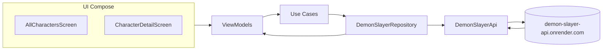
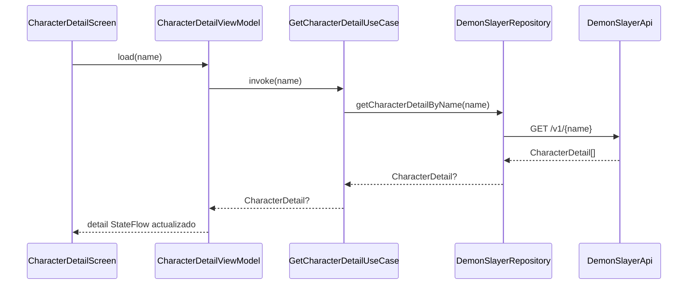

# Diagramas Mermaid

## Flujo de datos principal

```mermaid
flowchart LR
    subgraph UI[UI Compose]
        ListScreen[AllCharactersScreen]
        DetailScreen[CharacterDetailScreen]
    end
    VM[ViewModels]
    UC[Use Cases]
    Repo[DemonSlayerRepository]
    Api[DemonSlayerApi]
    Remote[(demon-slayer-api.onrender.com)]

    UI --> VM
    VM --> UC
    UC --> Repo
    Repo --> Api
    Api --> Remote
    Remote --> Api
    Repo --> VM
```

## Ciclo de vida del detalle

```mermaid
sequenceDiagram
    participant UI as CharacterDetailScreen
    participant VM as CharacterDetailViewModel
    participant UC as GetCharacterDetailUseCase
    participant Repo as DemonSlayerRepository
    participant API as DemonSlayerApi

    UI->>VM: load(name)
    VM->>UC: invoke(name)
    UC->>Repo: getCharacterDetailByName(name)
    Repo->>API: GET /v1/{name}
    API-->>Repo: CharacterDetail[]
    Repo-->>UC: CharacterDetail?
    UC-->>VM: CharacterDetail?
    VM-->>UI: detail StateFlow actualizado
```
